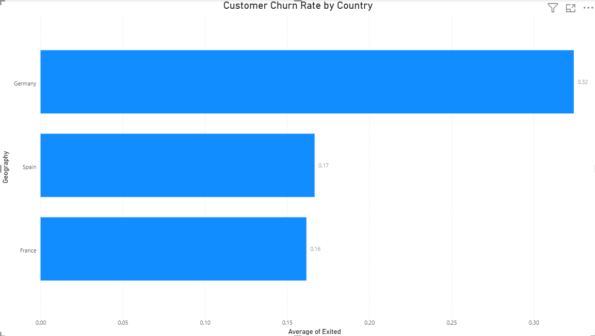

# Bank Customer Churn -SQL Project

## Initial project structure

```
bank-customer-churn-sql/
|
├─ data/
│  ├─ raw/
│  └─ processed/
|
├─ sql/
│  ├─ 01_setup.sql
│  ├─ 02_exploration.sql
│  ├─ 03_kpis.sql
│  ├─ 04_segmentation.sql
│  ├─ 05_risk_profiles.sql
│  └─ 06_final_insights.sql
|
├─ outputs/
|  ├─ figures
|  |     └─ churn_by_country.png
│  └─ results.md        # copy/paste key query outputs + insights
|
├─ import_csv.py
└─ README.md
```

## Project Overview

This project analyzes customer churn in a retail bank using SQL.

The analysis explores key factors related to customer churn such as:
- geography
- gender
- activity level
- number of products
- customer demographics

The goal is to identify patterns associated with higher churn risk.

## Business Problem

Customer churn is a major challenge for retail banks, as losing customers directly affects revenue and long-term growth.

The goal of this project is to analyze customer data to identify patterns associated with higher churn risk and to highlight customer segments that may require targeted retention strategies.

## Dataset

Source: Kaggle - Bank Customer Churn Dataset

The dataset contains information about 10,000 bank customers including:
- credit score
- geography
- gender
- age
- tenure
- balance
- number of products
- activity status
- churn status

## Tools used

- SQL (SQLite)
- Vs Code
- Git & GitHub

## Analysis Steps

The analysis was conducted in several stages:
1. Data import and database setup
2. Initial dataset exploration
3. Key performance metrics (overall churn rate)
4. Customer segmentation by:
    - geography
    - gender
    - activity status
    - number of products
    - age groups
    - credit score
    - income level
5. Identification of high-risk and low-risk customer segments
6. Final insights and interpretation of churn drivers

## Key findings

Key patterns identified in the dataset include:
- Customers aged **51-65** with **inactive membership** show the highest churn risk.
- Customers with **only one product** churn significantly more often.
- **Active customers** have much lower churn rates.
- Customers with **two products** show the lowest churn rate.
- **Germany** has the highest churn rate among the analyzed countries.

These findings suggest that increasing customer engagement and encouraging multi-product usage may significantly reduce churn.

## Visualization

Customer churn rate by country:

